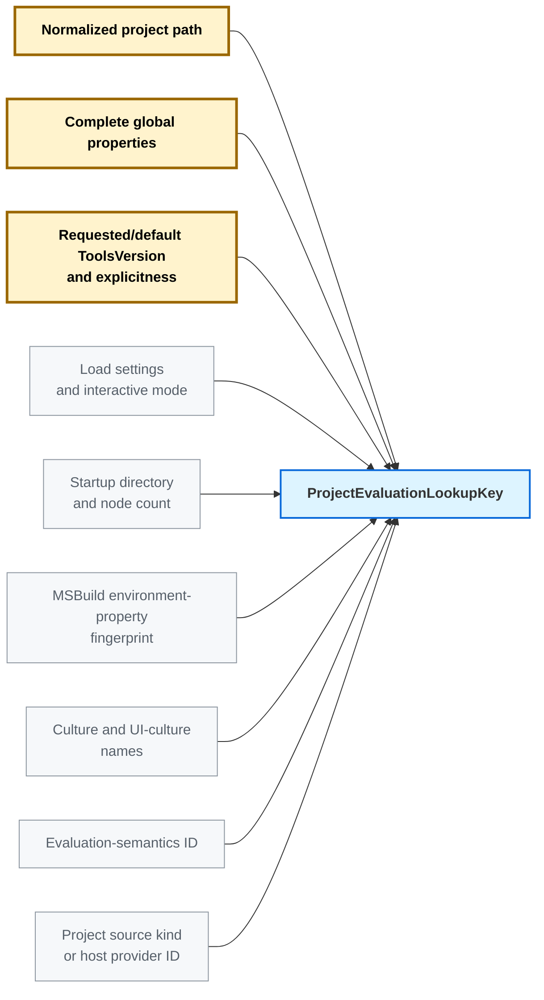
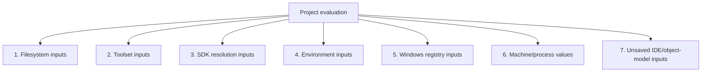

# Evaluation cache inputs and stale detection

Full inventory: [Evaluation cache invalidation: problem space and solution space](evaluation-cache-problem-and-solution-spaces.md)

> **Goal:** cache an evaluated `ProjectInstance`, reuse it while every evaluation input is current, and reevaluate it after a concrete detector proves that an input is stale.

> **Cache scope:** this investigation assumes an in-memory cache owned by one long-lived MSBuild server process and used only by the same operating-system user. It is not persisted or shared across users, server processes, or machines.

---

## Input stability overview

The first design question is whether an input is expected to change during normal development.

| Evaluation input | Expected to change between builds? | Stored as |
| --- | --- | --- |
| Root project file (`.csproj`, `.vbproj`, `.fsproj`, or another project file) | Yes | Candidate key (path) + evaluation entry observation (contents) |
| Project-owned imported `.props` and `.targets` | Yes | Evaluation entry observation |
| Restore-generated imports under `obj`, such as `*.nuget.g.props` and `*.nuget.g.targets` | Yes | Evaluation entry observation |
| File/directory existence results from `Exists()` and import probes | Yes | Evaluation entry observation |
| Directory contents and glob expansions | Yes | Evaluation entry observation |
| Imported MSBuild environment properties | Yes | Candidate key |
| Environment variables read on demand through property functions | Yes | Evaluation entry observation |
| Complete global properties and other request-specific build settings | Yes | Candidate key |
| Windows Registry values read during evaluation | Yes | Evaluation entry observation |
| Filesystem metadata or accessibility state used by evaluation | Yes | Evaluation entry observation |
| Unsaved IDE/object-model project state | Yes | Evaluation entry observation |
| Installed SDK files such as `Sdk.props` and `Sdk.targets` | No, normally stable | Evaluation entry observation |
| Other existing files under the selected installed .NET SDK | No, normally stable | Evaluation entry observation |
| Contents of an already extracted versioned NuGet package | No, normally stable | Evaluation entry observation |
| Installed framework tools and reference assemblies | No, normally stable | Evaluation entry observation |
| Default SDK resolver binaries/manifests under the MSBuild installation | No, normally stable | Evaluation entry observation |
| Server-lifetime values such as machine name and the server process command line | No, normally stable | Server/cache scope |


**Candidate key** values are available before source loading. **Evaluation entry observations** are discovered during evaluation and stored beside the cached result. **Server/cache scope** values are assumed constant while this in-memory server cache exists.


## Candidate cache key

Cache lookup happens before MSBuild loads the root project XML, selects the effective toolset, or resolves SDKs. The lookup key must therefore contain only cheap values already available from the build request.




| Candidate-key input | Existing MSBuild source | Rule |
| --- | --- | --- |
| Project path | `BuildRequestConfiguration.ProjectFullPath` | Normalize the default-disk path. A non-default source uses a stable provider ID; its content/version remains entry metadata. |
| Complete global properties | `BuildRequestConfiguration.GlobalProperties` | Hash every property using MSBuild's case-insensitive name semantics. Do not use the prototype's selected nine-property subset. |
| Requested/default tools version | `BuildRequestConfiguration.ToolsVersion` and `ExplicitToolsVersionSpecified` | Include both value and explicitness, so explicit `Current` does not collide with implicit default `Current`. |
| Evaluation settings | Effective `ProjectLoadSettings`, request flags, and `BuildParameters.Interactive` | Include only settings known before source loading that can change evaluation results. |
| Startup directory and node count | `BuildParameters.StartupDirectory` and `MaxNodeCount` | Include the exact values because they directly become `$(MSBuildStartupDirectory)` and `$(MSBuildNodeCount)` during evaluation. |
| MSBuild environment-property dictionary | `BuildParameters.EnvironmentPropertiesInternal` | Fingerprint the exact dictionary MSBuild supplies as initial properties: include environment-variable names that are valid MSBuild/XML property names and are not reserved item/property names; exclude the others. Include MSBuild-synthesized values such as `MSBuildExtensionsPath*`, `LocalAppData`, and `MSBuildUserExtensionsPath`. |
| Culture and UI culture | `BuildParameters.Culture` and `UICulture` | When the build request starts, capture `Culture.Name` and `UICulture.Name` once—for example `en-US` and `en-US`—and reuse those exact values in every project candidate key for that request. Encode them directly in the key; a separate hash is optional. |
| ChangeWave state | `src/Framework/ChangeWaves.cs` and `Traits.MSBuildDisableFeaturesFromVersion` | Include the effective ChangeWave state in the evaluation-semantics ID because it can enable or disable evaluation behavior. |
| Evaluation traits and escape hatches | `src/Framework/Traits.cs`. Examples: `IgnoreEmptyImports`, `IgnoreTreatAsLocalProperty`, `UseCaseSensitiveItemNames`, and `SdkReferencePropertyExpansion`. | Classify every value that can change the evaluated result and include it in the evaluation-semantics ID. Exclude logging/debug/performance-only traits. |
| Evaluation feature switches | `src/Framework/FeatureSwitches.cs`. Examples: `RestrictPropertyFunctionReceivers`, `EnableSdkResolverDynamicLoading`, `EnableConfigurationFileToolsets`, and `EnableReflectiveTaskParameterTypes`. | Classify result-affecting switches and include them in the evaluation-semantics ID. A switch such as `EnableAllPropertyFunctions` makes evaluation non-cacheable instead. |
| Evaluation process statics | Process-global fields read by evaluation. Examples in `src/Build/Utilities/Utilities.cs`: legacy/default tools-version behavior controlled by `MSBUILDLEGACYDEFAULTTOOLSVERSION` and `MSBUILDTREATHIGHERTOOLSVERSIONASCURRENT`. | Classify result-affecting statics and include their current values in the evaluation-semantics ID. |
| Project source kind/provider | Identifies how the root project source is supplied: normal disk file, IDE-owned in-memory XML, remote object-model source, or another custom provider | Use a fixed value such as `DefaultDisk` for ordinary files. An IDE/custom host must provide a stable ID for its source semantics. The current MSBuild host interfaces do not expose this ID, so that is new plumbing. The mutable XML content/version remains entry metadata, not key data. |


---

## Cached evaluation-input categories

Only the input categories in this section share a numeric list. Later sections describe cache policy and correctness rules rather than additional input categories.



### 1. Filesystem inputs

Every supported filesystem read/probe/enumeration must pass through an observation layer. The observation must describe the value actually consumed.

| Evaluation input | Where evaluation uses it (concrete example) | Observation stored with the entry | Exact stale-detection mechanism |
| --- | --- | --- | --- |
| File content read during evaluation | Evaluation reads the contents of a file. **Example:** the root project, imported `.props`/`.targets`, and a supported `$([System.IO.File]::ReadAllText('version.txt'))` call. | Normalized path of every file whose contents were read during evaluation | For mutable files, a matching watcher event, USN/host delta record, or validation mismatch for change/delete/replacement/rename sets `entry.IsStale = true`. Existing files classified as normally stable are recorded but not monitored per file. A read that bypasses recording is non-cacheable. |
| File/directory existence probe | Evaluation branches on whether a path exists and what kind it is. **Example:** `Exists('generated.props')` can decide whether to import a file, while `$([System.IO.Directory]::Exists('generated'))` can decide whether to add generated-source items. | Requested kind (`File`, `Directory`, or either), path, and authoritative outcome: `Present(actual kind)` or `NotFound`. For a deep missing path, also store the nearest existing parent and first missing component. | Register the parent/child identity with the change service. A watcher event, USN/host delta, or validation mismatch reporting create/delete/rename/replacement/kind change sets `entry.IsStale = true`. Outcome `Failure` is non-cacheable. |
| Import fallback search paths | For an import that directly uses a property configured in the toolset's `<projectImportSearchPaths>`, MSBuild tries the property's current value and then each configured fallback directory in order. **Example:** `MSBuildExtensionsPath=C:\Primary`, with fallbacks `C:\Fallback1;C:\Fallback2`, makes `<Import Project="$(MSBuildExtensionsPath)\Contoso\Custom.targets" />` try those three directories in that order. | Ordered candidate paths, whether each was `Present` or `NotFound`, and the file that was selected | Register every candidate. A watcher event, USN/host delta, or validation mismatch showing that an earlier candidate appeared or the selected candidate changed/disappeared sets `entry.IsStale = true`. |
| Upward file search | Evaluation searches the project directory and then each parent directory. **Example:** `GetPathOfFileAbove`, `GetDirectoryNameOfFileAbove`, and `Directory.Build.props`/`Directory.Build.targets` discovery select the nearest matching file. | Starting directory, searched file name, and selected file path—or that no file was found | Register every searched directory/candidate. A watcher event, USN/host delta, or validation mismatch showing a nearer file appeared or the selected file changed/disappeared sets `entry.IsStale = true`. |
| Directory membership or glob | Evaluation expands a filtered directory set. **Example:** `<Compile Include="src\**\*.cs" Exclude="src\obj\**\*" />` produces the evaluated `@(Compile)` items. | Base directory, include/exclude glob strings, and the expanded list of paths returned to evaluation | Register the glob directory cone. A watcher event, USN/host delta, or validation re-enumeration showing a create/delete/rename/membership change sets `entry.IsStale = true`. |
| Metadata value | Evaluation reads filesystem metadata. **Example:** `<Stamp Include="@(Compile->'%(ModifiedTime)')" />` reads a source timestamp. MSBuild also compares project/import write times for `$(MSBuildAllProjects)`: build 1 can select newer `b.props`; after the user edits `a.props`, build 2 can select `a.props`. | Path, metadata field, and value returned to evaluation | A watcher metadata event, USN/host metadata record, or validation mismatch for the recorded field sets `entry.IsStale = true`. |
| Permission/accessibility result | Evaluation sees different paths or outcomes because of access control. **Example:** `Directory.GetFiles('generated')` returns fewer entries when one child directory is unreadable, or an import probe receives access denied. | Path, operation, and authoritative success/failure result | A `NotifyFilters.Security` event, USN/host security record, or validation mismatch sets `entry.IsStale = true`. Access changes caused only by user/group membership, security policy, mount options, or an unsupported filesystem have no reliable detector and are non-cacheable. |
| Symlink/reparse-point input | A project reads a path that is a link to another file. **Example:** `<Import Project="current.props" />` initially resolves `current.props` to `v1.props`; before the next build, the link is changed to point to `v2.props`. | The link path, resolved target path, and target file identity read by evaluation | A watcher event, USN/host delta, or validation mismatch for the link or resolved target sets `entry.IsStale = true`. Reevaluation resolves and records the target again. Unsupported link identity is non-cacheable. |

### Live filesystem detectors and alternatives

During project evaluation, an observation layer records every filesystem operation:

- file read → file path;
- existence probe → path, requested kind, and `Present`/`NotFound`;
- glob or directory enumeration → base directory, include/exclude expressions, and expanded paths;
- metadata read → path, metadata field, and returned value.

Dependency discovery and later change detection are separate. The in-process observation layer discovers what evaluation used. A watcher, journal, host delta, or validation step later decides whether those recorded inputs changed.

Use one shared change service per root/volume and a reverse index from recorded input identity to cache entries. Do not create one watcher or journal cursor per entry.

| Change-detection approach | Platform/lifetime | How it marks an entry stale | Strength and cost |
| --- | --- | --- | --- |
| `.NET FileSystemWatcher` | Windows, Linux, and macOS; running server only | A matching `Changed`, `Created`, `Deleted`, or `Renamed` callback is mapped through the reverse index and sets `entry.IsStale = true`. Error, overflow, or watched-root loss broadly stales the affected root. | Low idle cost and simple deployment, but callback delivery can overflow, race, or be coalesced. It is an invalidation accelerator, not standalone proof. |
| Windows USN change journal | Windows local NTFS/ReFS volumes; can cover running-server and persistent-cache history while the journal remains continuous | Keep one cursor per volume. Scan records since the previous cursor, map file IDs/reasons through the reverse index, and set matching entries stale. Journal reset, wrap, or inaccessible state broadly invalidates or falls back to validation. | Stronger historical change source than directory callbacks; requires a volume handle, cursor management, and journal scanning. Do not store one USN per entry. |
| Manifest validation | Cross-platform; any cache lifetime | Re-read/re-probe/re-enumerate recorded inputs and compare with stored observations. Any mismatch sets the entry stale. | Portable correctness fallback, but highest I/O/CPU cost. Use on detector uncertainty rather than every healthy server-local hit. |
| Persistent native FSEvents IDs | macOS; possible future persistent optimization | Persist a per-volume event ID, read events since it, and stale affected subtrees. Dropped events, root changes, ID discontinuity, or coalescing uncertainty require validation/broad invalidation. | Requires native interop; events remain hints rather than complete current-state proof. |

Recommended platform choice:

| OS | Normal change source | Fallback on uncertainty |
| --- | --- | --- |
| Windows | USN journal when available; `FileSystemWatcher` otherwise | Broad root invalidation or manifest validation |
| Linux | `FileSystemWatcher` over `inotify` | Manifest validation or a host snapshot/delta token; Linux has no generally available durable journal |
| macOS | `FileSystemWatcher` over FSEvents | Broad subtree/root invalidation or manifest validation; persistent FSEvents IDs are a later option |


---

### 2. Toolset inputs

| Evaluation input | Where evaluation uses it (concrete example) | Observation stored with the entry | Exact stale-detection mechanism |
| --- | --- | --- | --- |
| Effective MSBuild toolset | After MSBuild reads the project request/source, it determines the effective toolset—normally `Current`—that supplies paths and default properties. **Example:** it supplies `$(MSBuildToolsPath)` and `$(MSBuildExtensionsPath32)`. | Fingerprint of the actual `Toolset` used: tools version/path, properties, selected subtoolset, and import search paths | Entry metadata, not part of the candidate key. Add new plumbing so `ToolsetProvider` precomputes a fingerprint for each toolset it holds. Before reuse, compare the stored fingerprint with the current toolset's fingerprint; if it differs or that toolset no longer exists, set `entry.IsStale = true`. |
| Toolset definition source | Older or custom hosts can define a toolset in an MSBuild configuration file or, on Windows, in the Registry. **Example:** the definition supplies `MSBuildToolsPath` and import fallback directories. | Configuration-file path or Windows Registry key used to load the toolset | Register the configuration file with the shared filesystem change service; a matching watcher event, USN/host delta, or validation mismatch sets the entry stale. On Windows, `RegNotifyChangeKeyValue` handles the Registry source. Rebuild the toolset before reevaluation. |

---

### 3. SDK resolution inputs

```text
SDK request from project
  -> resolver chooses an SdkResult
  -> MSBuild loads the returned SDK files and values
```

`SdkResult` can contain success/failure, one or more paths, a version, properties, items with metadata, and environment values.

| Evaluation input | Where evaluation uses it (concrete example) | Observation stored with the entry | Exact stale-detection mechanism |
| --- | --- | --- | --- |
| Effective SDK location/environment | SDK resolution uses the effective `MSBuildSDKsPath` and build environment. **Example:** `MSBuildSDKsPath=C:\dotnet\sdk\10.0.100\Sdks`. | Effective `MSBuildSDKsPath`, selected SDK/result identity, and build-environment/provider token | Entry metadata, not part of the candidate key. Before reusing a candidate, validate the stored SDK/build-environment token. A mismatch sets `entry.IsStale = true`. MSBuild engine/runtime compatibility belongs to the cache namespace/header. |
| SDK request from project | The project asks for an SDK by name and optional version. **Example:** `<Project Sdk="Microsoft.NET.Sdk/10.0.100">`. | SDK name, version, and minimum version, plus the project/import file containing the request | Register the declaring file with the filesystem change service; a matching watcher event, USN/host delta, or validation mismatch sets the entry stale. For in-memory XML, use `ProjectXmlChanged` or `ProjectRootElement.Version`. |
| Default SDK directory | The built-in resolver checks `MSBuildSDKsPath\<SdkName>\Sdk`. **Example:** `...\Sdks\Microsoft.NET.Sdk\Sdk`. | Exact directory path and whether it was present or missing | Register the directory-existence observation with the filesystem change service. A watcher event, USN/host delta, or validation mismatch for create/delete/rename/replacement sets the entry stale. A probe failure that cannot be distinguished from missing is non-cacheable. |
| Resolver files and configuration | MSBuild finds and loads resolver plugins. **Example:** a resolver manifest, `Contoso.SdkResolver.dll`, `MSBUILDADDITIONALSDKRESOLVERSFOLDER`, workload manifests, or `NuGet.config`. | Resolver/configuration file paths, resolver-folder paths, and environment values used to find them | Default resolver binaries/manifests under the MSBuild installation are assumed stable and are not monitored per file. Additional/custom resolver folders, workload manifests, and `NuGet.config` use the shared filesystem change service; environment-selected locations are compared with the next request snapshot. |
| SDK resolution result and private resolver state | The returned `SdkResult` can add paths, properties, items, metadata, and environment values. **Example:** a resolver returns an additional SDK path and `PropertiesToAdd["WorkloadEnabled"]="true"`. | Complete result fingerprint, resolver identity, and resolver-provided dependency/private-state token | A resolver `Changed` callback or token mismatch sets every entry using that result to stale. A custom resolver that cannot provide its dependencies or token is non-cacheable. |
| Resolved SDK files | MSBuild evaluates files returned by the result. **Example:** `Sdk.props` and `Sdk.targets`. | Exact paths of all SDK files read during evaluation | Files under the selected installed .NET SDK are assumed stable for the server lifetime and are not monitored per file. Files from custom or mutable SDK locations use the shared filesystem change service; a matching watcher event, USN/host delta, or validation mismatch sets the entry stale. |

---

### 4. Environment inputs

Imported environment properties are already represented in the Candidate cache key section. This category covers environment values read on demand.

Evaluation must use one immutable raw environment snapshot for all supported environment APIs. Validation compares against the next request snapshot; it never calls the live process environment.

| Evaluation input | Where evaluation uses it (concrete example) | Observation stored with the entry | Exact stale-detection mechanism |
| --- | --- | --- | --- |
| One environment variable | A property function reads one named value. **Example:** `$([System.Environment]::GetEnvironmentVariable('HOME'))` writes the current home directory into an evaluated property. | Name and value-or-missing result from the immutable raw request snapshot | At lookup, read `HOME` from the new immutable request snapshot and compare it with the stored value/missing marker. If they differ, set `entry.IsStale = true`; do not call the live process environment. |
| Environment enumeration | A property function consumes the whole environment. **Example:** `$([System.Environment]::GetEnvironmentVariables())` can be passed to custom evaluation logic that derives items or properties. | Complete raw environment dictionary using platform name-comparison semantics | At lookup, compare the new request's complete raw environment dictionary with the stored dictionary using Windows or Unix name semantics. Any added, removed, or changed pair sets `entry.IsStale = true`. |
| Environment expansion | Evaluation expands variable references embedded in text. **Example:** `$([System.Environment]::ExpandEnvironmentVariables('%HOME%\generated'))` can produce an import or item path. | Expanded text plus every referenced variable name/value-or-missing result | At lookup, compare every recorded variable name with the new immutable request snapshot. If any value/missing marker differs, set `entry.IsStale = true` and recompute the expansion during reevaluation. |

---

### 5. Windows registry inputs

| Evaluation input | Where evaluation uses it (concrete example) | Observation stored with the entry | Exact stale-detection mechanism |
| --- | --- | --- | --- |
| Existing Windows registry value | Evaluation reads an installed-component setting. **Example:** `$(Registry:HKEY_LOCAL_MACHINE\Software\Contoso@InstallPath)` or `[MSBuild]::GetRegistryValue` produces an import/tool path. | Hive, view, key, value name, type, and returned unexpanded data | Open the recorded key and register/re-arm `RegNotifyChangeKeyValue` for name, last-set, attributes, and security changes. When Windows signals that registration, its callback sets `entry.IsStale = true`. For `REG_EXPAND_SZ`, separately compare the referenced Environment inputs. |
| Missing Windows registry key/value | Evaluation falls back when a registry value is absent. **Example:** a missing `Contoso@InstallPath` causes `$(ContosoPath)` to use `C:\Default\Contoso`. | Missing leaf and nearest existing parent key | Register `RegNotifyChangeKeyValue` on the existing key when only the value is missing, or on the nearest existing parent with subtree/name monitoring when the key is missing. A creation/last-set notification invokes the callback that sets `entry.IsStale = true`. |

---

### 6. Machine and process values

These are values read from the current computer or running MSBuild process that are not files, environment variables, or registry entries. Values already represented unconditionally in the key—such as OS/runtime/architecture and culture semantics—are not duplicated here.

| Evaluation input | Where evaluation uses it (concrete example) | Observation stored with the entry | Exact stale-detection mechanism |
| --- | --- | --- | --- |
| Logical-drive/volume set | Evaluation enumerates drives or mounts. **Example:** `$([System.Environment]::GetLogicalDrives())` can generate items for each available drive. | Ordered volume set plus host volume/mount token | Register a host volume-change callback and store the returned volume-set token. The callback, or a token mismatch checked before reuse, sets `entry.IsStale = true`. Without this host contract, an evaluation that calls `GetLogicalDrives` is non-cacheable. |
| Server-lifetime values | Evaluation can read values fixed for the running MSBuild server. **Example:** `$([System.Environment]::MachineName)` returns the computer name and `$([System.Environment]::CommandLine)` returns the command that started the server process. | No separate observation; these values are part of the server/cache scope | No watcher or per-hit check. They are assumed not to change during the lifetime of this in-memory server cache. A new server process starts with an empty cache. |
| Startup/effective evaluation directory | Evaluation can resolve relative paths against the build request's startup directory. **Example:** `$([System.IO.Path]::GetFullPath('config\settings.props'))`. | `BuildParameters.StartupDirectory` | Part of the candidate cache key. If it changes, the next request selects a different candidate. No watcher is needed. |
| Processor count | Evaluation can use the available processor count. **Example:** `$([System.Environment]::ProcessorCount)` controls a property or condition. | Processor-count value returned during evaluation | There is no portable change notification. **Open question:** assume it is stable for the server lifetime, put it in the cache key, or make an evaluation that reads it non-cacheable. |
| Volatile process/time value | Evaluation reads a value expected to change without a usable notification. **Example:** `Environment.WorkingSet`, `Environment.StackTrace`, `Environment.TickCount`, `DateTime.Now`, or `DateTime.UtcNow`. | No stable observation | Non-cacheable: if evaluation reads one of these values, do not store the evaluation result. |

---

### 7. Unsaved IDE/object-model project inputs

An IDE or another MSBuild API host can change project XML/state in memory without saving the project file. A filesystem watcher sees no change, but the cached evaluation must still become stale.

| Evaluation input | Where evaluation uses it (concrete example) | Observation stored with the entry | Exact stale-detection mechanism |
| --- | --- | --- | --- |
| Unsaved changes to a loaded project | The IDE/host changes a `ProjectRootElement` or `Project` through the MSBuild API but does not save it. **Example:** `projectRootElement.AddProperty("LangVersion", "preview")` changes the next evaluation while the `.csproj` file on disk remains unchanged. | The source `Project`/`ProjectRootElement` object and its current version | Subscribe to existing `ProjectCollection.ProjectXmlChanged` and `ProjectCollection.ProjectChanged`. Their callbacks set `entry.IsStale = true`. Before reuse, also compare the current `ProjectRootElement.Version` with the stored version. |
| Host-created or remote in-memory project | The project source is generated or owned by the host instead of a normal disk file. **Example:** `ProjectRootElement.Create(XmlReader)` evaluates generated XML, or `ProjectRootElementLink` exposes a remote project object. | Stable host source identity and monotonically changing version | When the host changes the in-memory source, its callback sets `entry.IsStale = true`; a version mismatch before reuse does the same. Without stable identity/version support, the evaluation is non-cacheable. |

---

## IDE/object-model host support

An IDE/object-model host is a program that uses the `Microsoft.Build` APIs directly instead of asking MSBuild to load only a project-file path.

This cache must support these hosts. Real use cases include:

- Visual Studio or another project system evaluating unsaved project XML for IntelliSense and design-time features;
- a tool creating a `ProjectRootElement` from `XmlReader` or generated XML;
- a host calling `Project.CreateProjectInstance()` and submitting that `ProjectInstance` through `BuildRequestData`;
- object-model remoting through `ProjectRootElementLink`.

Use existing `ProjectRootElement.Version`, `ProjectXmlChanged`, and `ProjectChanged` for API-edited projects. In-memory/generated XML and remote-linked projects must provide stable source identity and version tokens; without that contract, that individual evaluation is non-cacheable.

---

## Open questions

### How should `Environment.ProcessorCount` be handled?

`ProcessorCount` can affect evaluation, but there is no portable event that reports when process affinity, container CPU limits, or the effective processor count changes.

Options:

- assume it remains stable for the MSBuild server lifetime;
- include the current value in every candidate cache key;
- make only evaluations that read `ProcessorCount` non-cacheable.

---

## Inputs that make evaluation non-cacheable

| Input/problem | Where evaluation uses it (concrete example) | Detection point | Cache action |
| --- | --- | --- | --- |
| Nondeterministic or unclassified property function | **Example:** `$([System.Guid]::NewGuid())` or `$([System.DateTime]::UtcNow)` is assigned to an evaluated property. | Property-function dispatch before/at invocation | Do not store the evaluation |
| All-property-functions mode | **Example:** with `MSBUILDENABLEALLPROPERTYFUNCTIONS=1`, project XML invokes `Contoso.Build.State::ReadDatabaseValue()`. | Feature-switch check before lookup/admission | Bypass lookup and admission |

---

## Correctness rule

> Every value that can change the evaluated `ProjectInstance` must be either:
>
> 1. represented in `ProjectEvaluationLookupKey`;
> 2. recorded as an observation with an exact event/token/request-snapshot comparison that sets `entry.IsStale = true`; or
> 3. classified as non-cacheable.

No row may use “when the value changes” as its detector. It must name the producer of the signal, the stored observation, the invalidating event/comparison, and the exact stale transition.

Evidence:

- [`Evaluator.Evaluate`](../../../src/Build/Evaluation/Evaluator.cs#L318-L365)
- [`FeatureSwitches`](../../../src/Framework/FeatureSwitches.cs)
- [`Traits`](../../../src/Framework/Traits.cs)
- [`EvaluationContext`](../../../src/Build/Evaluation/Context/EvaluationContext.cs#L14-L71)
- [`CachingFileSystemWrapper`](../../../src/Framework/FileSystem/CachingFileSystemWrapper.cs#L12-L54)
- [`ProjectRootElement.Version`](../../../src/Build/Construction/ProjectRootElement.cs#L590-L623)
- [`ProjectCollection` change events](../../../src/Build/Definition/ProjectCollection.cs#L457-L477)
- [`DefaultSdkResolver`](../../../src/Build/BackEnd/Components/SdkResolution/DefaultSdkResolver.cs#L23-L35)
- [`CachingSdkResolverService`](../../../src/Build/BackEnd/Components/SdkResolution/CachingSdkResolverService.cs#L17-L72)
- [`SolutionProjectGenerator.ScanProjectDependencies`](../../../src/Build/Construction/Solution/SolutionProjectGenerator.cs#L2196-L2262)
- [MSBuild evaluation phase](https://learn.microsoft.com/visualstudio/msbuild/build-process-overview#evaluation-phase)
