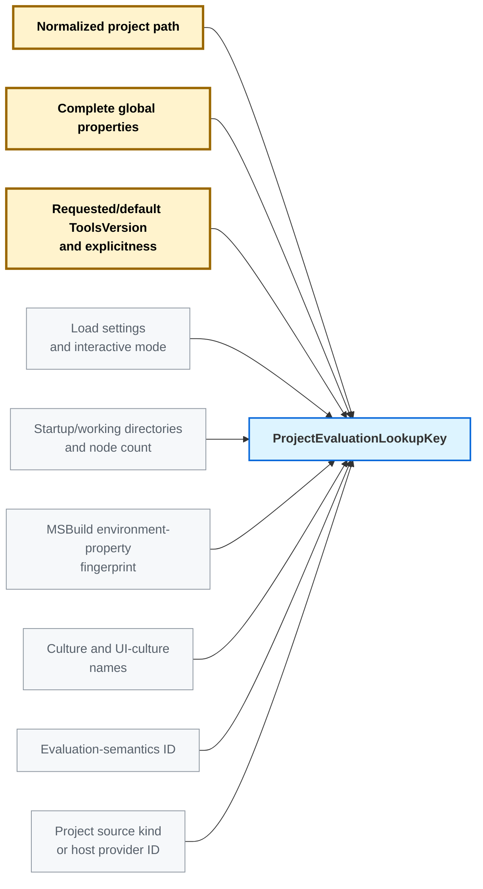
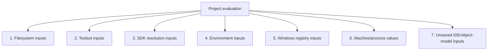

# Evaluation cache inputs and stale detection

Context: [evaluation-cache epic](https://github.com/dotnet/msbuild/issues/14234), [ProjectInstance reuse prototype](https://github.com/dotnet/msbuild/pull/14857), and [v1 observation and filesystem-validation prototype](https://github.com/dotnet/msbuild/pull/14940).

> **Goal:** cache an evaluated `ProjectInstance`, reuse it only while every evaluation input is current, and reevaluate when an input changes or its validity cannot be established.

> **Cache scope:** this investigation assumes an in-memory cache owned by one long-lived MSBuild server process and used only by the same operating-system user. It is not persisted or shared across users, server processes, or machines.

---

## What v1 implements (2026-09-07)

With `MSBUILDRECORDEVALUATIONINPUTS=1`, v1 exposes `EvaluationInputs` on `Project` and `ProjectInstance`. It records inputs and provides a filesystem-only check; it does **not** save or reuse evaluated projects.

The **V1 prototype status** columns below distinguish recorded inputs, request-key fields, partial coverage, unsupported inputs, and assumed-stable state. The other observation schemas and event/token mechanisms describe the intended design, not APIs already implemented in v1.

V1 has no watcher/journal service, registry or environment validation, SDK dependency contract, or complete cache-hit validation. Unsupported/volatile inputs mark the report non-cacheable and stop further recording. `IsFileSystemCurrent` returns `false` at the first changed path, failed check, or non-cacheable report; it does not set an `entry.IsStale` field or authorize reuse by itself.

The manifest is not a full process-access trace: resolver internals, installed-tool discovery, library loading, and some OS/runtime state are not comprehensively observed. Process-lifetime stability assumptions do not replace the missing dependency contracts needed for complete reuse.

## Input stability overview

The first design question is whether an input is expected to change during normal development or within one **inner development loop**.

Here, an inner loop means repeated edit/build runs in the same checkout and server, with the same configuration, target framework, other request settings, request environment, and installed tools. Under those assumptions, some generally mutable inputs are usually stable. This is not immutability: another process, a restore, or a changed build request can still change them. Request values remain keyed or validated, and a 15-minute server idle lifetime does not prove that inputs stayed unchanged.

| Evaluation input | Expected to change between builds? | Within a fixed inner dev loop | Stored as |
| --- | --- | --- | --- |
| Root project file (`.csproj`, `.vbproj`, `.fsproj`, or another project file) | Yes | Can change; usually unchanged during source-code-only edits | Candidate key (path) + evaluation entry observation (v1: file metadata) |
| Project-owned imported `.props` and `.targets` | Yes | Can change when build settings are edited | Evaluation entry observation |
| Restore-generated imports under `obj`, such as `*.nuget.g.props` and `*.nuget.g.targets` | Yes | Usually stable until restore or its inputs change | Evaluation entry observation |
| File/directory existence results from `Exists()` and import probes | Yes | Mutable: edits, generation, cleanup, and restore can change them | Evaluation entry observation |
| Directory contents and glob expansions | Yes | Mutable: adding, removing, or renaming files changes membership | Evaluation entry observation |
| Imported MSBuild environment properties | Yes | Usually stable for an unchanged request environment; still part of the key | Candidate key |
| Environment variables read on demand through property functions | Yes | Usually stable for an unchanged request environment; still need validation | Evaluation entry observation |
| Complete global properties and other request-specific build settings | Yes | Stable while all request settings stay fixed; a changed request needs a different key | Candidate key |
| Windows Registry values read during evaluation | Yes | Usually stable without installation/configuration changes; other processes can still edit them | Evaluation entry observation |
| Filesystem metadata or accessibility state used by evaluation | Yes | Mutable, including timestamps changed by ordinary edits | Evaluation entry observation |
| Unsaved IDE/object-model project state | Yes | Mutable in an IDE loop; absent from disk-only CLI evaluation | Evaluation entry observation |
| Installed SDK files such as `Sdk.props` and `Sdk.targets` | No, normally stable | Usually stable while the installation is unchanged | Evaluation entry observation |
| Other existing files under the selected installed .NET SDK | No, normally stable | Usually stable while the installation is unchanged | Evaluation entry observation |
| Contents of an already extracted versioned NuGet package | No, normally stable | Usually stable; cache cleanup, replacement, or extraction can change them | Evaluation entry observation |
| Installed framework tools and reference assemblies | No, normally stable | Usually stable while the installation is unchanged | Evaluation entry observation |
| Default SDK resolver binaries/manifests under the MSBuild installation | No, normally stable | Usually stable while the installation is unchanged | Evaluation entry observation |
| Server-lifetime values such as machine name and the server process command line | No, normally stable | Assumed stable for this server; not every machine setting is process-constant | Server/cache scope |


**Candidate key** values are available before source loading. **Evaluation entry observations** are discovered during evaluation and stored beside the cached result. **Server/cache scope** values are assumed constant while this in-memory server cache exists.

V1 checks every recorded filesystem path, including SDK/package files that are usually stable. A future optimization that skips their checks needs an explicit installation-state lifetime or change detector, not merely a low expectation of edits.


## Candidate cache key

Cache lookup happens before MSBuild loads the root project XML, selects the effective toolset, or resolves SDKs. The lookup key must therefore contain only cheap values already available from the build request.

V1's `EvaluationInputKey` is a recorded evaluation identity, not a finished pre-evaluation lookup implementation. It includes the effective toolset and parser fingerprints, both directories, all global properties, environment properties, cultures, engine version, and disabled ChangeWave. It does not yet provide the complete semantics/provider identity proposed below or compare keys before reuse.




| Candidate-key input | Existing MSBuild source | Rule | V1 prototype status |
| --- | --- | --- | --- |
| Project path | `BuildRequestConfiguration.ProjectFullPath` | Normalize the default-disk path. A non-default source uses a stable provider ID; its content/version remains entry metadata. | **Key**: normalized disk path; non-default host identity is not supported. |
| Complete global properties | `BuildRequestConfiguration.GlobalProperties` | Include every property using MSBuild's case-insensitive name semantics and exact values. V1 stores the full sorted name/value sequence, not a selected subset. | **Key**: all global properties. |
| Requested/default tools version | `BuildRequestConfiguration.ToolsVersion` and `ExplicitToolsVersionSpecified` | Include both value and explicitness, so explicit `Current` does not collide with implicit default `Current`. | **Partial key**: effective toolset version/path/subtoolset and fingerprint; explicit-tools-version provenance is not retained. |
| Evaluation settings | Effective `ProjectLoadSettings`, request flags, and `BuildParameters.Interactive` | Include only settings known before source loading that can change evaluation results. | **Key**: evaluation stage, load settings, interactive mode. |
| Startup/working directories and node count | `BuildParameters.StartupDirectory`, effective working directory, and `MaxNodeCount` | Include the exact directories for relative-path resolution and built-in properties, and the node count used by `$(MSBuildNodeCount)`. | **Key**: all three values. |
| MSBuild environment-property dictionary | `BuildParameters.EnvironmentPropertiesInternal` | Fingerprint the exact dictionary MSBuild supplies as initial properties: include environment-variable names that are valid MSBuild/XML property names and are not reserved item/property names; exclude the others. Include MSBuild-synthesized values such as `MSBuildExtensionsPath*`, `LocalAppData`, and `MSBuildUserExtensionsPath`. | **Key**: imported-property fingerprint. |
| Culture and UI culture | `BuildParameters.Culture` and `UICulture` | When the build request starts, capture `Culture.Name` and `UICulture.Name` once—for example `en-US` and `en-US`—and reuse those exact values in every project candidate key for that request. Encode them directly in the key; a separate hash is optional. | **Key**: both culture names. |
| ChangeWave state | `src/Framework/ChangeWaves.cs` and `Traits.MSBuildDisableFeaturesFromVersion` | Include the effective ChangeWave state in the evaluation-semantics ID because it can enable or disable evaluation behavior. | **Key**: disabled ChangeWave setting; engine version is also recorded. |
| Evaluation traits and escape hatches | `src/Framework/Traits.cs`. Examples: `IgnoreEmptyImports`, `IgnoreTreatAsLocalProperty`, `UseCaseSensitiveItemNames`, and `SdkReferencePropertyExpansion`. | Classify every value that can change the evaluated result and include it in the evaluation-semantics ID. Exclude logging/debug/performance-only traits. | **Partial**: no complete evaluation-trait semantics ID. |
| Evaluation feature switches | `src/Framework/FeatureSwitches.cs`. Examples: `RestrictPropertyFunctionReceivers`, `EnableSdkResolverDynamicLoading`, `EnableConfigurationFileToolsets`, and `EnableReflectiveTaskParameterTypes`. | Classify result-affecting switches and include them in the evaluation-semantics ID. A switch such as `EnableAllPropertyFunctions` makes evaluation non-cacheable instead. | **Partial**: no complete switch fingerprint; all-property-functions mode blocks reuse. |
| Evaluation process statics | Process-global fields read by evaluation. Examples in `src/Build/Utilities/Utilities.cs`: legacy/default tools-version behavior controlled by `MSBUILDLEGACYDEFAULTTOOLSVERSION` and `MSBUILDTREATHIGHERTOOLSVERSIONASCURRENT`. | Classify result-affecting statics and include their current values in the evaluation-semantics ID. | **Not tracked** as a complete semantics ID; some process state is assumed stable. |
| XML-parser configuration | `ParserIgnoreConfiguration` and `Directory.Parse.config` | Include parser settings already known before source loading. Record project-discovered configuration files as entry observations rather than reading them just to construct the lookup key. | **Key + files**: v1 captures a parser fingerprint and configuration-file paths; placement in the pre-evaluation lookup remains to be aligned. |
| Project source kind/provider | Identifies how the root project source is supplied: normal disk file, IDE-owned in-memory XML, remote object-model source, or another custom provider | Use a fixed value such as `DefaultDisk` for ordinary files. An IDE/custom host must provide a stable ID for its source semantics. The current MSBuild host interfaces do not expose this ID, so that is new plumbing. The mutable XML content/version remains entry metadata, not key data. | **Unsupported**: no provider ID/version contract; unsaved/pathless projects block reuse. |


---

## Cached evaluation-input categories

Only the input categories in this section share a numeric list. Later sections describe cache policy and correctness rules rather than additional input categories.



### 1. Filesystem inputs

Every supported filesystem read/probe/enumeration must pass through an observation layer. The observation must describe the value actually consumed.

| Evaluation input | Where evaluation uses it (concrete example) | Observation stored with the entry | Exact stale-detection mechanism | V1 prototype status |
| --- | --- | --- | --- | --- |
| File content read during evaluation | Evaluation reads the contents of a file. **Example:** the root project, imported `.props`/`.targets`, and a supported `$([System.IO.File]::ReadAllText('version.txt'))` call. | Normalized path of every file whose contents were read during evaluation | For mutable files, a matching watcher event, USN/host delta record, or validation mismatch for change/delete/replacement/rename sets `entry.IsStale = true`. Skipping monitoring of normally stable files would require an enforced installation-state boundary; v1 checks every recorded path. A read that bypasses recording is non-cacheable. | **Recorded + timestamp check**: paths, kinds, write times, and lengths; no content hashes. |
| File/directory existence probe | Evaluation branches on whether a path exists and what kind it is. **Example:** `Exists('generated.props')` can decide whether to import a file, while `$([System.IO.Directory]::Exists('generated'))` can decide whether to add generated-source items. | Requested kind (`File`, `Directory`, or either), path, and authoritative outcome: `Present(actual kind)` or `NotFound`. For a deep missing path, also store the nearest existing parent and first missing component. | Register the parent/child identity with the change service. A watcher event, USN/host delta, or validation mismatch reporting create/delete/rename/replacement/kind change sets `entry.IsStale = true`. Outcome `Failure` is non-cacheable. | **Recorded + timestamp check**: path kind, including missing paths; no separate nearest-parent/first-missing record. |
| Import fallback search paths | For an import that directly uses a property configured in the toolset's `<projectImportSearchPaths>`, MSBuild tries the property's current value and then each configured fallback directory in order. **Example:** `MSBuildExtensionsPath=C:\Primary`, with fallbacks `C:\Fallback1;C:\Fallback2`, makes `<Import Project="$(MSBuildExtensionsPath)\Contoso\Custom.targets" />` try those three directories in that order. | Ordered candidate paths, whether each was `Present` or `NotFound`, and the file that was selected | Register every candidate. A watcher event, USN/host delta, or validation mismatch showing that an earlier candidate appeared or the selected candidate changed/disappeared sets `entry.IsStale = true`. | **Recorded + timestamp check**: candidate probes and selected files reached through evaluation; no ordered search record. |
| Upward file search | Evaluation searches the project directory and then each parent directory. **Example:** `GetPathOfFileAbove`, `GetDirectoryNameOfFileAbove`, and `Directory.Build.props`/`Directory.Build.targets` discovery select the nearest matching file. | Starting directory, searched file name, and selected file path—or that no file was found | Register every searched directory/candidate. A watcher event, USN/host delta, or validation mismatch showing a nearer file appeared or the selected file changed/disappeared sets `entry.IsStale = true`. | **Recorded + timestamp check**: paths probed by supported searches; no separate search recipe. |
| Directory membership or glob | Evaluation expands a filtered directory set. **Example:** `<Compile Include="src\**\*.cs" Exclude="src\obj\**\*" />` produces the evaluated `@(Compile)` items. | Base directory, include/exclude glob strings, and the expanded list of paths returned to evaluation | Register the glob directory cone. A watcher event, USN/host delta, or validation re-enumeration showing a create/delete/rename/membership change sets `entry.IsStale = true`. | **Recorded + timestamp check**: traversal directories, including shared-cache replay; no standalone glob-expression/result-set manifest. |
| Metadata value | Evaluation reads filesystem metadata. **Example:** `<Stamp Include="@(Compile->'%(ModifiedTime)')" />` reads a source timestamp. MSBuild also compares project/import write times for `$(MSBuildAllProjects)`: build 1 can select newer `b.props`; after the user edits `a.props`, build 2 can select `a.props`. | Path, metadata field, and value returned to evaluation | A watcher metadata event, USN/host metadata record, or validation mismatch for the recorded field sets `entry.IsStale = true`. | **Partial**: supported last-write-time reads; length is stored for validation. Item `ModifiedTime`/`CreatedTime`/`AccessedTime` and additional metadata calls block reuse. |
| Permission/accessibility result | Evaluation sees different paths or outcomes because of access control. **Example:** `Directory.GetFiles('generated')` returns fewer entries when one child directory is unreadable, or an import probe receives access denied. | Path, operation, and authoritative success/failure result | A `NotifyFilters.Security` event, USN/host security record, or validation mismatch sets `entry.IsStale = true`. Access changes caused only by user/group membership, security policy, mount options, or an unsupported filesystem have no reliable detector and are non-cacheable. | **Not tracked**: no ACL/security observation; detected observation/stat failures reject the report or check. |
| Symlink/reparse-point input | A project reads a path that is a link to another file. **Example:** `<Import Project="current.props" />` initially resolves `current.props` to `v1.props`; before the next build, the link is changed to point to `v2.props`. | The link path, resolved target path, and target file identity read by evaluation | A watcher event, USN/host delta, or validation mismatch for the link or resolved target sets `entry.IsStale = true`. Reevaluation resolves and records the target again. Unsupported link identity is non-cacheable. | **Unsupported**: direct links block reuse; parent-link retargeting can be missed. |

### Timestamp validation in v1

V1 stores each normalized path's kind (`Missing`, `File`, or `Directory`), UTC last-write timestamp, and file length. `IsFileSystemCurrent` stats those paths again and compares the tuples, stopping at the first mismatch or failure. This detects creation, deletion, kind changes, and ordinary edits without rereading file contents.

For glob membership, v1 compares timestamps of the directories traversed during expansion, including traversal dependencies replayed from existing glob caches. It does not re-expand every glob during validation.

This scan grows with the number of recorded paths. [Prototype measurements](https://github.com/dotnet/msbuild/pull/14940#issuecomment-5560255488) took 5.8-7.5% of fresh evaluation time on OrchardCore and Roslyn (about 93% less time), for filesystem checks only. Unchanged timestamps/lengths do not prove unchanged contents; metadata-preserving edits, parent-link changes, and races during recording can be missed. Content fingerprints and stronger change tracking remain future work.

### Live filesystem detectors and alternatives

The fuller observation design would describe each supported filesystem operation as follows; the V1 status column above identifies what is actually retained today:

- file read → file path;
- existence probe → path, requested kind, and `Present`/`NotFound`;
- glob or directory enumeration → base directory, include/exclude expressions, and expanded paths;
- metadata read → path, metadata field, and returned value.

Dependency discovery and later change detection are separate. The in-process observation layer discovers what evaluation used. A watcher, journal, host delta, or validation step later decides whether those recorded inputs changed.

If a notification-based design is chosen, use one shared change service per root/volume and a reverse index from recorded input identity to cache entries. Do not create one watcher or journal cursor per entry.

| Change-detection approach | Platform/lifetime | How it marks an entry stale | Strength and cost |
| --- | --- | --- | --- |
| **V1 timestamp/metadata validation** | Cross-platform; invoked explicitly | Compare each recorded path's kind, last-write time, and length with a fresh stat; `IsFileSystemCurrent` returns `false` on the first difference or failure. | Implemented; linear in the recorded path count and does not reread contents. Subject to the metadata and race limitations above. |
| `.NET FileSystemWatcher` | Windows, Linux, and macOS; running server only | A matching `Changed`, `Created`, `Deleted`, or `Renamed` callback is mapped through the reverse index and sets `entry.IsStale = true`. Error, overflow, or watched-root loss broadly stales the affected root. | Low idle cost and simple deployment, but callback delivery can overflow, race, or be coalesced. It is an invalidation accelerator, not standalone proof. |
| Windows USN change journal | Windows local NTFS/ReFS volumes; can cover running-server and persistent-cache history while the journal remains continuous | Keep one cursor per volume. Scan records since the previous cursor, map file IDs/reasons through the reverse index, and set matching entries stale. Journal reset, wrap, or inaccessible state broadly invalidates or falls back to validation. | Stronger historical change source than directory callbacks; requires a volume handle, cursor management, and journal scanning. Do not store one USN per entry. |
| Manifest validation | Cross-platform; any cache lifetime | Re-read/re-probe/re-enumerate recorded inputs and compare with stored observations. Any mismatch sets the entry stale. | Portable correctness fallback, but highest I/O/CPU cost. Use on detector uncertainty rather than every healthy server-local hit. |
| Persistent native FSEvents IDs | macOS; possible future persistent optimization | Persist a per-volume event ID, read events since it, and stale affected subtrees. Dropped events, root changes, ID discontinuity, or coalescing uncertainty require validation/broad invalidation. | Requires native interop; events remain hints rather than complete current-state proof. |

Candidate platform choices beyond v1 (not implemented):

| OS | Normal change source | Fallback on uncertainty |
| --- | --- | --- |
| Windows | USN journal when available; `FileSystemWatcher` otherwise | Broad root invalidation or manifest validation |
| Linux | `FileSystemWatcher` over `inotify` | Manifest validation or a host snapshot/delta token; Linux has no generally available durable journal |
| macOS | `FileSystemWatcher` over FSEvents | Broad subtree/root invalidation or manifest validation; persistent FSEvents IDs are a later option |


---

### 2. Toolset inputs

| Evaluation input | Where evaluation uses it (concrete example) | Observation stored with the entry | Exact stale-detection mechanism | V1 prototype status |
| --- | --- | --- | --- | --- |
| Effective MSBuild toolset | After MSBuild reads the project request/source, it determines the effective toolset—normally `Current`—that supplies paths and default properties. **Example:** it supplies `$(MSBuildToolsPath)` and `$(MSBuildExtensionsPath32)`. | Fingerprint of the actual `Toolset` used: tools version/path, properties, selected subtoolset, and import search paths | Entry metadata, not part of the candidate key. Add new plumbing so `ToolsetProvider` precomputes a fingerprint for each toolset it holds. Before reuse, compare the stored fingerprint with the current toolset's fingerprint; if it differs or that toolset no longer exists, set `entry.IsStale = true`. | **Key**: effective versions, paths, and toolset fingerprint; not compared before reuse. |
| Toolset definition source | Older or custom hosts can define a toolset in an MSBuild configuration file or, on Windows, in the Registry. **Example:** the definition supplies `MSBuildToolsPath` and import fallback directories. | Configuration-file path or Windows Registry key used to load the toolset | Register the configuration file with the shared filesystem change service; a matching watcher event, USN/host delta, or validation mismatch sets the entry stale. On Windows, `RegNotifyChangeKeyValue` handles the Registry source. Rebuild the toolset before reevaluation. | **Not tracked**: internal configuration/registry dependencies are not comprehensively observed. |

---

### 3. SDK resolution inputs

```text
SDK request from project
  -> resolver chooses an SdkResult
  -> MSBuild loads the returned SDK files and values
```

`SdkResult` can contain success/failure, one or more paths, a version, properties, items with metadata, and environment values.

| Evaluation input | Where evaluation uses it (concrete example) | Observation stored with the entry | Exact stale-detection mechanism | V1 prototype status |
| --- | --- | --- | --- | --- |
| Effective SDK location/environment | SDK resolution uses the effective `MSBuildSDKsPath` and build environment. **Example:** `MSBuildSDKsPath=C:\dotnet\sdk\10.0.100\Sdks`. | Effective `MSBuildSDKsPath`, selected SDK/result identity, and build-environment/provider token | Entry metadata, not part of the candidate key. Before reusing a candidate, validate the stored SDK/build-environment token. A mismatch sets `entry.IsStale = true`. MSBuild engine/runtime compatibility belongs to the cache namespace/header. | **Partial**: SDK request/result and environment-property fingerprint; no provider/private-state token. |
| SDK request from project | The project asks for an SDK by name and optional version. **Example:** `<Project Sdk="Microsoft.NET.Sdk/10.0.100">`. | SDK name, version, and minimum version, plus the project/import file containing the request | Register the declaring file with the filesystem change service; a matching watcher event, USN/host delta, or validation mismatch sets the entry stale. For in-memory XML, use `ProjectXmlChanged` or `ProjectRootElement.Version`. | **Recorded**: SDK reference and result; declaring project/import files are filesystem inputs. |
| Default SDK directory | The built-in resolver checks `MSBuildSDKsPath\<SdkName>\Sdk`. **Example:** `...\Sdks\Microsoft.NET.Sdk\Sdk`. | Exact directory path and whether it was present or missing | Register the directory-existence observation with the filesystem change service. A watcher event, USN/host delta, or validation mismatch for create/delete/rename/replacement sets the entry stale. A probe failure that cannot be distinguished from missing is non-cacheable. | **Not tracked** as a resolver-internal probe; returned imported files are covered separately. |
| Resolver files and configuration | MSBuild finds and loads resolver plugins. **Example:** a resolver manifest, `Contoso.SdkResolver.dll`, `MSBUILDADDITIONALSDKRESOLVERSFOLDER`, workload manifests, or `NuGet.config`. | Resolver/configuration file paths, resolver-folder paths, and environment values used to find them | Treating default resolver binaries/manifests as stable requires an explicit installation-state assumption. Additional/custom resolver folders, workload manifests, and `NuGet.config` use the shared filesystem change service; environment-selected locations are compared with the next request snapshot. | **Not tracked**: resolver dependencies need an MSBuild/resolver contract. |
| SDK resolution result and private resolver state | The returned `SdkResult` can add paths, properties, items, metadata, and environment values. **Example:** a resolver returns an additional SDK path and `PropertiesToAdd["WorkloadEnabled"]="true"`. | Complete result fingerprint, resolver identity, and resolver-provided dependency/private-state token | A resolver `Changed` callback or token mismatch sets every entry using that result to stale. A custom resolver that cannot provide its dependencies or token is non-cacheable. | **Partial**: `SdkResult` is retained; no dependency token or private-state validation. |
| Resolved SDK files | MSBuild evaluates files returned by the result. **Example:** `Sdk.props` and `Sdk.targets`. | Exact paths of all SDK files read during evaluation | A future policy may treat installed SDK files as stable under an enforced installation-state boundary; v1 still checks their recorded metadata. Files from custom or mutable SDK locations use the shared filesystem change service; a matching watcher event, USN/host delta, or validation mismatch sets the entry stale. | **Recorded + timestamp check**: includes installed SDK files actually read during evaluation. |

---

### 4. Environment inputs

Imported environment properties are already represented in the Candidate cache key section. This category covers environment values read on demand.

The proposed validation design uses one immutable raw request-environment snapshot. V1 does not implement that contract: it records returned values for supported `GetEnvironmentVariable` calls and reads referenced process variables after `ExpandEnvironmentVariables`. Its environment-property fingerprint covers the imported property dictionary, not arbitrary raw-environment enumeration. No environment values are revalidated yet.

| Evaluation input | Where evaluation uses it (concrete example) | Observation stored with the entry | Exact stale-detection mechanism | V1 prototype status |
| --- | --- | --- | --- | --- |
| One environment variable | A property function reads one named value. **Example:** `$([System.Environment]::GetEnvironmentVariable('HOME'))` writes the current home directory into an evaluated property. | Name and value-or-missing result from the immutable raw request snapshot | At lookup, read `HOME` from the new immutable request snapshot and compare it with the stored value/missing marker. If they differ, set `entry.IsStale = true`; do not call the live process environment. | **Recorded**: supported single-argument reads, including missing values; no validation. |
| Environment enumeration | A property function consumes the whole environment. **Example:** `$([System.Environment]::GetEnvironmentVariables())` can be passed to custom evaluation logic that derives items or properties. | Complete raw environment dictionary using platform name-comparison semantics | At lookup, compare the new request's complete raw environment dictionary with the stored dictionary using Windows or Unix name semantics. Any added, removed, or changed pair sets `entry.IsStale = true`. | **Unsupported**: `GetEnvironmentVariables()` blocks reuse. |
| Environment expansion | Evaluation expands variable references embedded in text. **Example:** `$([System.Environment]::ExpandEnvironmentVariables('%HOME%\generated'))` can produce an import or item path. | Expanded text plus every referenced variable name/value-or-missing result | At lookup, compare every recorded variable name with the new immutable request snapshot. If any value/missing marker differs, set `entry.IsStale = true` and recompute the expansion during reevaluation. | **Partial**: referenced names and process values are recorded after expansion; no immutable request-snapshot contract or validation. |

---

### 5. Windows registry inputs

V1 records logical reads through `$(Registry:...)`, `[MSBuild]::GetRegistryValue`, and `[MSBuild]::GetRegistryValueFromView`: key, value name, requested view tokens, and returned value before MSBuild conversion. Missing values remain `null` or the intrinsic's returned fallback. Array values are copied; unsupported mutable fallback objects block reuse. This is not a trace of every internal probe, the winning view, or the registry value's raw type/unexpanded data.

| Evaluation input | Where evaluation uses it (concrete example) | Observation stored with the entry | Exact stale-detection mechanism | V1 prototype status |
| --- | --- | --- | --- | --- |
| Existing Windows registry value | Evaluation reads an installed-component setting. **Example:** `$(Registry:HKEY_LOCAL_MACHINE\Software\Contoso@InstallPath)` or `[MSBuild]::GetRegistryValue` produces an import/tool path. | Hive, view, key, value name, type, and returned unexpanded data | Open the recorded key and register/re-arm `RegNotifyChangeKeyValue` for name, last-set, attributes, and security changes. When Windows signals that registration, its callback sets `entry.IsStale = true`. For `REG_EXPAND_SZ`, separately compare the referenced Environment inputs. | **Recorded**: logical key/value request, requested views, and returned value; no validation. |
| Missing Windows registry key/value | Evaluation falls back when a registry value is absent. **Example:** a missing `Contoso@InstallPath` causes `$(ContosoPath)` to use `C:\Default\Contoso`. | Missing leaf and nearest existing parent key | Register `RegNotifyChangeKeyValue` on the existing key when only the value is missing, or on the nearest existing parent with subtree/name monitoring when the key is missing. A creation/last-set notification invokes the callback that sets `entry.IsStale = true`. | **Partial**: returned null/fallback; no missing-key/value distinction or nearest-parent observation. |

**Open question: reread instead of notifications?** Measure whether rereading the small set of recorded registry values before reuse is cheaper and simpler than maintaining `RegNotifyChangeKeyValue` registrations. Compare results with the observations and reject reuse on a mismatch or failed check. This is still validation, but needs no change-notification infrastructure.

The comparison must preserve view order, default/missing values, fallback behavior, array contents, and environment expansion. V1's logical result alone does not retain all arguments/raw-state information needed to replay every read; extend the observation where necessary. Neither reread validation nor registry notifications are implemented yet.

---

### 6. Machine and process values

These are values read from the current computer or running MSBuild process that are not files, environment variables, or registry entries. Request-key values such as directories and cultures, and server-scope OS/runtime/architecture identity, should not be recorded again as separate dependencies.

| Evaluation input | Where evaluation uses it (concrete example) | Observation stored with the entry | Exact stale-detection mechanism | V1 prototype status |
| --- | --- | --- | --- | --- |
| Logical-drive/volume set | Evaluation enumerates drives or mounts. **Example:** `$([System.Environment]::GetLogicalDrives())` can generate items for each available drive. | Ordered volume set plus host volume/mount token | Register a host volume-change callback and store the returned volume-set token. The callback, or a token mismatch checked before reuse, sets `entry.IsStale = true`. Without this host contract, an evaluation that calls `GetLogicalDrives` is non-cacheable. | **Unsupported**: `GetLogicalDrives()` blocks reuse. |
| Server-lifetime values | Evaluation can read values fixed for the running MSBuild server. **Example:** `$([System.Environment]::MachineName)` returns the computer name and `$([System.Environment]::CommandLine)` returns the command that started the server process. | No separate observation; these values are part of the server/cache scope | No watcher or per-hit check. They are assumed not to change during the lifetime of this in-memory server cache. A new server process starts with an empty cache. | **Assumed stable**, not separately observed; installed-tool and some OS/runtime state use this assumption too. |
| Startup/effective evaluation directory | Evaluation can resolve relative paths against the build request's startup directory. **Example:** `$([System.IO.Path]::GetFullPath('config\settings.props'))`. | `BuildParameters.StartupDirectory` | Part of the candidate cache key. If it changes, the next request selects a different candidate. No watcher is needed. | **Key**: startup and working directories. |
| Processor count | Evaluation can use the available processor count. **Example:** `$([System.Environment]::ProcessorCount)` controls a property or condition. | Processor-count value returned during evaluation | There is no portable change notification. **Open question:** assume it is stable for the server lifetime, put it in the cache key, or make an evaluation that reads it non-cacheable. | **Assumed stable** for the process; no separate observation or validation. |
| Volatile process/time value | Evaluation reads a value expected to change without a usable notification. **Example:** `Environment.WorkingSet`, `Environment.StackTrace`, `Environment.TickCount`, `DateTime.Now`, or `DateTime.UtcNow`. | No stable observation | Non-cacheable: if evaluation reads one of these values, do not store the evaluation result. | **Non-cacheable**: known volatile calls, including time and random/GUID values. |

---

### 7. Unsaved IDE/object-model project inputs

An IDE or another MSBuild API host can change project XML/state in memory without saving the project file. A filesystem watcher sees no change, but the cached evaluation must still become stale.

| Evaluation input | Where evaluation uses it (concrete example) | Observation stored with the entry | Exact stale-detection mechanism | V1 prototype status |
| --- | --- | --- | --- | --- |
| Unsaved changes to a loaded project | The IDE/host changes a `ProjectRootElement` or `Project` through the MSBuild API but does not save it. **Example:** `projectRootElement.AddProperty("LangVersion", "preview")` changes the next evaluation while the `.csproj` file on disk remains unchanged. | The source `Project`/`ProjectRootElement` object and its current version | Subscribe to existing `ProjectCollection.ProjectXmlChanged` and `ProjectCollection.ProjectChanged`. Their callbacks set `entry.IsStale = true`. Before reuse, also compare the current `ProjectRootElement.Version` with the stored version. | **Unsupported**: unsaved XML blocks reuse. |
| Host-created or remote in-memory project | The project source is generated or owned by the host instead of a normal disk file. **Example:** `ProjectRootElement.Create(XmlReader)` evaluates generated XML, or `ProjectRootElementLink` exposes a remote project object. | Stable host source identity and monotonically changing version | When the host changes the in-memory source, its callback sets `entry.IsStale = true`; a version mismatch before reuse does the same. Without stable identity/version support, the evaluation is non-cacheable. | **Unsupported**: no stable host identity/version contract. |

---

## IDE/object-model host support

An IDE/object-model host is a program that uses the `Microsoft.Build` APIs directly instead of asking MSBuild to load only a project-file path.

The eventual cache should support these hosts. Real use cases include:

- Visual Studio or another project system evaluating unsaved project XML for IntelliSense and design-time features;
- a tool creating a `ProjectRootElement` from `XmlReader` or generated XML;
- a host calling `Project.CreateProjectInstance()` and submitting that `ProjectInstance` through `BuildRequestData`;
- object-model remoting through `ProjectRootElementLink`.

Use existing `ProjectRootElement.Version`, `ProjectXmlChanged`, and `ProjectChanged` for API-edited projects. In-memory/generated XML and remote-linked projects must provide stable source identity and version tokens; without that contract, that individual evaluation is non-cacheable.

This is future support, not v1 behavior. Unsaved or pathless projects and caller-provided filesystems/directory caches currently block reuse.

---

## Open questions

### How should `Environment.ProcessorCount` be handled?

`ProcessorCount` can affect evaluation, but there is no portable event that reports when process affinity, container CPU limits, or the effective processor count changes.

V1 currently chooses the server-lifetime assumption: it classifies this property as process-constant and records no separate value or change detector. The long-term policy is still open.

Options:

- assume it remains stable for the MSBuild server lifetime;
- include the current value in every candidate cache key;
- make only evaluations that read `ProcessorCount` non-cacheable.

---

## Inputs that make evaluation non-cacheable

| Input/problem | Where evaluation uses it (concrete example) | Detection point | Cache action |
| --- | --- | --- | --- |
| Nondeterministic or unclassified property function | **Example:** `$([System.Guid]::NewGuid())` or `$([System.DateTime]::UtcNow)` is assigned to an evaluated property. | Property-function dispatch before/at invocation | Do not store the evaluation |
| All-property-functions mode | **Example:** with `MSBUILDENABLEALLPROPERTYFUNCTIONS=1`, project XML invokes `Contoso.Build.State::ReadDatabaseValue()`. | Feature-switch check before lookup/admission | Bypass lookup and admission |

---

## Correctness rule

> Every value that can change the evaluated `ProjectInstance` must be either:
>
> 1. represented in `ProjectEvaluationLookupKey`;
> 2. recorded as an observation with a defined change detector or value comparison that rejects stale or unverifiable entries; or
> 3. classified as non-cacheable.

No row may use “when the value changes” as its detector. It must name the producer of the signal, the stored observation, the invalidating event/comparison, and the exact stale transition.

This is the target correctness rule, not a claim that the metadata-only v1 prototype already satisfies it for every input.

Evidence (v1 source snapshot; subsequent implementation may differ):

- [`EvaluationInputs`](https://github.com/dotnet/msbuild/blob/39ebf0c8a954b95cf0ec9376456a7cb9562c3067/src/Build/Evaluation/Context/EvaluationInputs.cs)
- [`EvaluationInputRecorder`](https://github.com/dotnet/msbuild/blob/39ebf0c8a954b95cf0ec9376456a7cb9562c3067/src/Build/Evaluation/Context/EvaluationInputRecorder.cs)
- [`EvaluationInputValidator`](https://github.com/dotnet/msbuild/blob/39ebf0c8a954b95cf0ec9376456a7cb9562c3067/src/Build/Evaluation/Context/EvaluationInputValidator.cs)
- [`PropertyFunctionEffects`](https://github.com/dotnet/msbuild/blob/39ebf0c8a954b95cf0ec9376456a7cb9562c3067/src/Build/Evaluation/Context/PropertyFunctionEffects.cs)

- [`Evaluator.Evaluate`](https://github.com/dotnet/msbuild/blob/39ebf0c8a954b95cf0ec9376456a7cb9562c3067/src/Build/Evaluation/Evaluator.cs)
- [`FeatureSwitches`](https://github.com/dotnet/msbuild/blob/39ebf0c8a954b95cf0ec9376456a7cb9562c3067/src/Framework/FeatureSwitches.cs)
- [`Traits`](https://github.com/dotnet/msbuild/blob/39ebf0c8a954b95cf0ec9376456a7cb9562c3067/src/Framework/Traits.cs)
- [`EvaluationContext`](https://github.com/dotnet/msbuild/blob/39ebf0c8a954b95cf0ec9376456a7cb9562c3067/src/Build/Evaluation/Context/EvaluationContext.cs)
- [`CachingFileSystemWrapper`](https://github.com/dotnet/msbuild/blob/39ebf0c8a954b95cf0ec9376456a7cb9562c3067/src/Framework/FileSystem/CachingFileSystemWrapper.cs)
- [`ProjectRootElement.Version`](https://github.com/dotnet/msbuild/blob/39ebf0c8a954b95cf0ec9376456a7cb9562c3067/src/Build/Construction/ProjectRootElement.cs)
- [`ProjectCollection` change events](https://github.com/dotnet/msbuild/blob/39ebf0c8a954b95cf0ec9376456a7cb9562c3067/src/Build/Definition/ProjectCollection.cs)
- [`DefaultSdkResolver`](https://github.com/dotnet/msbuild/blob/39ebf0c8a954b95cf0ec9376456a7cb9562c3067/src/Build/BackEnd/Components/SdkResolution/DefaultSdkResolver.cs)
- [`CachingSdkResolverService`](https://github.com/dotnet/msbuild/blob/39ebf0c8a954b95cf0ec9376456a7cb9562c3067/src/Build/BackEnd/Components/SdkResolution/CachingSdkResolverService.cs)
- [`SolutionProjectGenerator.ScanProjectDependencies`](https://github.com/dotnet/msbuild/blob/39ebf0c8a954b95cf0ec9376456a7cb9562c3067/src/Build/Construction/Solution/SolutionProjectGenerator.cs)
- [MSBuild evaluation phase](https://learn.microsoft.com/visualstudio/msbuild/build-process-overview#evaluation-phase)
